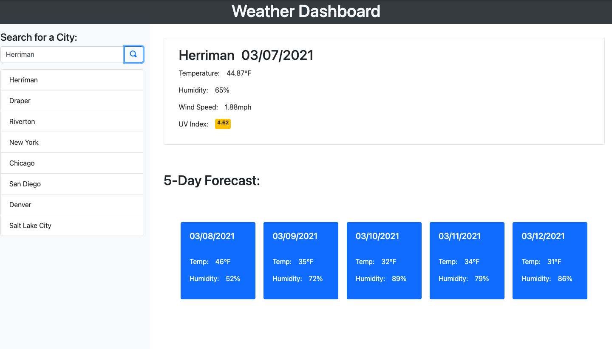

# Weather Dashboard
When a user enters a city name into the search bar, they are presented with that city's current weather conditions as well as a forecast for the next five days. The eight most recently searched cities will be added to a list beneath the search bar where they can be selected again.

link: https://matty-bennett.github.io/weather-dashboard/